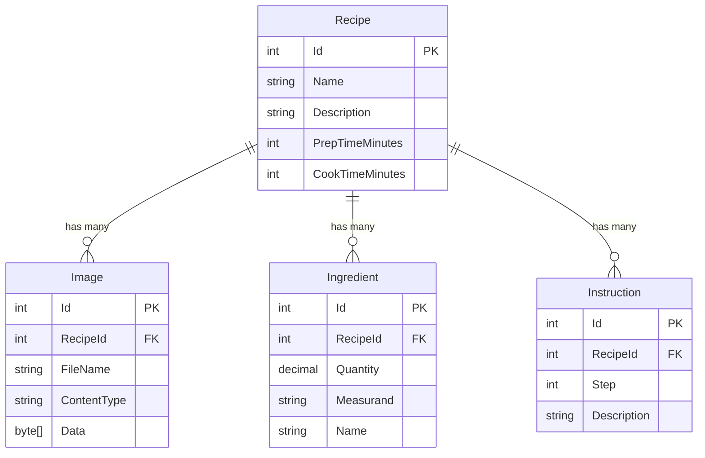

# LF8_Praxisprojekt_RecipeApp

```mermaid
erDiagram
    Recipe ||--o{ Image : "has many"
    Recipe ||--o{ Ingredient : "has many"
    Recipe ||--o{ Instruction : "has many"
    
    Recipe {
        int Id PK
        string Name
        string Description
        int PrepTimeMinutes
        int CookTimeMinutes
    }
    
    Image {
        int Id PK
        int RecipeId FK
        string FileName
        string ContentType
        byte[] Data
    }
    
    Ingredient {
        int Id PK
        int RecipeId FK
        decimal Quantity
        string Measurand
        string Name
    }
    
    Instruction {
        int Id PK
        int RecipeId FK
        int Step
        string Description
    }
```
